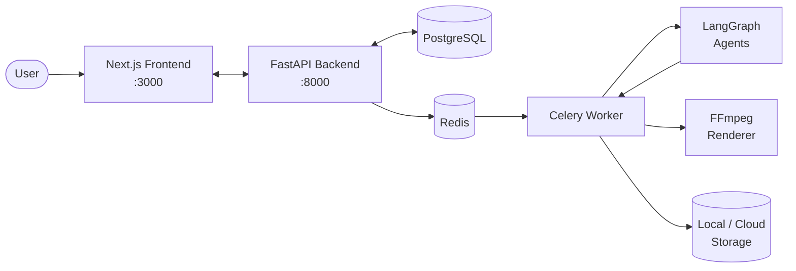
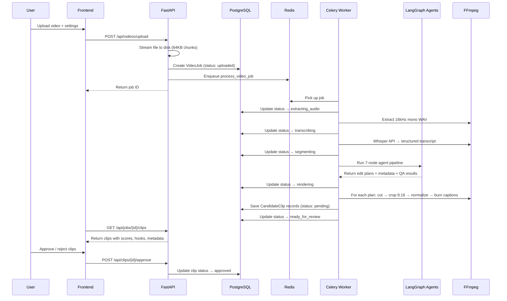

# ClipForge AI

AI-assisted video editing platform that transforms long-form video into polished, upload-ready short-form clips.

---

## The Problem

Creators, marketers, and educators routinely produce long-form videos — webinars, podcasts, conference talks, tutorials — but the platforms where audiences actually engage (YouTube Shorts, TikTok, Instagram Reels) demand short, vertical clips with captions and compelling hooks. Manually reviewing an hour of footage, identifying the best moments, cutting clips, reformatting to 9:16, adding captions, and writing metadata is tedious and time-consuming.

## The Solution

ClipForge AI automates the entire pipeline. You upload a video, and the system:

1. **Extracts and transcribes** the audio (via OpenAI Whisper)
2. **Identifies the strongest moments** using an AI agent pipeline
3. **Generates structured edit plans** — the AI *decides*, FFmpeg *executes*
4. **Renders vertical 9:16 clips** with burned-in captions
5. **Produces titles, descriptions, and hashtags** for each clip
6. **Presents everything** in a review interface where you approve, reject, or tweak

The key engineering principle is **separation of AI decision-making from deterministic media processing**. The AI agents produce structured `EditPlan` objects (JSON with timestamps, hooks, caption styles, audio settings, metadata). Deterministic tools — FFmpeg for rendering, SRT generators for captions — execute those plans exactly. The AI never directly manipulates video frames or audio samples.

This matters because media processing must be reproducible, debuggable, and predictable. If a clip renders incorrectly, you can inspect the `EditPlan` JSON, see exactly what the AI decided, and fix the plan without rerunning the AI. The rendering is a pure function of the plan.

## Architecture



| Component | Role |
|-----------|------|
| **Next.js Frontend** | Upload UI, job dashboard, clip review interface. Polls backend for status. |
| **FastAPI Backend** | REST API. Validates uploads, stores metadata, dispatches background jobs. |
| **PostgreSQL** | Stores jobs, clips, brand profiles. (SQLite available for local dev.) |
| **Redis** | Celery message broker and result backend. |
| **Celery Worker** | Runs the processing pipeline in the background: audio extraction → transcription → agent pipeline → rendering. |
| **LangGraph Agents** | 7-node pipeline that analyzes transcripts, selects moments, scores candidates, generates edit plans, metadata, and QA checks. |
| **FFmpeg** | Deterministic media processing: cut, crop to 9:16, normalize audio, burn captions. |
| **Storage** | Abstracted behind `StorageBackend` interface. MVP uses local filesystem; swappable to S3/GCS/R2. |

## End-to-End Workflow



## Quick Start

### Prerequisites

- **Python 3.11+**
- **Node.js 20+**
- **FFmpeg** on PATH
- **Docker** (for PostgreSQL + Redis) — or use SQLite mode for no-Docker dev
- **OpenAI API Key** (for transcription; heuristic scoring works without it)

### 1. Clone and configure

```bash
git clone <repo-url> && cd videoEdit
cp .env.example .env
# Edit .env — set your OPENAI_API_KEY
```

### 2. Start infrastructure

```bash
docker compose up -d   # PostgreSQL + Redis
```

Or skip Docker and use SQLite (edit `.env`):
```bash
DATABASE_URL=sqlite+aiosqlite:///./clipforge.db
```

### 3. Backend

```bash
cd backend
python -m venv .venv && source .venv/bin/activate
pip install -e ".[dev]"
uvicorn app.main:app --reload --port 8000
```

API available at http://localhost:8000 — interactive docs at http://localhost:8000/docs.

### 4. Frontend

```bash
cd frontend
npm install
npm run dev
```

UI available at http://localhost:3000.

### 5. Celery worker (background processing)

```bash
cd backend
source .venv/bin/activate
celery -A app.workers.celery_app worker --loglevel=info
```

> Without a running Celery worker, uploads will be accepted but videos won't be processed.

### Install FFmpeg

```bash
# macOS
brew install ffmpeg

# Ubuntu / Debian
sudo apt update && sudo apt install ffmpeg

# Windows (Chocolatey)
choco install ffmpeg

# Verify
ffmpeg -version
```

## Usage Examples

### Process a 30-minute webinar into 3 clips

1. Open http://localhost:3000 and click **Upload Video**.
2. Drop your `.mp4` file (up to 500 MB).
3. Configure:
   - **Target Audience:** "SaaS founders and product managers"
   - **Clip Count:** 3
   - **Duration:** 30–60 seconds
   - **Platform:** YouTube Shorts
   - **Tone:** Professional
4. Click **Upload**. The dashboard shows the job progressing through stages.
5. When status reaches **Ready for Review**, click the job to see generated clips.
6. For each clip you'll see: transcript snippet, hook text, score breakdown, and a rendered preview.
7. **Approve** the clips you want. **Reject** the rest. **Regenerate metadata** if you want new titles/hashtags.

### Process a video via the API

```bash
# Upload
curl -X POST http://localhost:8000/api/videos/upload \
  -F "file=@webinar.mp4" \
  -F "desired_clip_count=3" \
  -F "clip_duration_min=30" \
  -F "clip_duration_max=60" \
  -F "target_platforms=youtube_shorts" \
  -F "tone=professional"

# Check status
curl http://localhost:8000/api/jobs/{job_id}

# List clips when ready
curl http://localhost:8000/api/jobs/{job_id}/clips

# Approve a clip
curl -X POST http://localhost:8000/api/clips/{clip_id}/approve

# Download rendered clip
curl -O http://localhost:8000/api/clips/{clip_id}/download
```

### Expected output structure

```
storage/jobs/{job_id}/
├── original.mp4          # Uploaded video
├── audio.wav             # Extracted audio (16kHz mono)
├── transcript.json       # Whisper transcript
├── edit_plans.json       # Agent-generated edit plans
├── clips/
│   ├── clip_0.mp4        # Rendered vertical clip
│   ├── clip_0.srt        # Caption file
│   ├── clip_1.mp4
│   ├── clip_1.srt
│   └── ...
```

## Running Tests

```bash
cd backend
source .venv/bin/activate

pytest                          # all 87 tests
pytest -v                       # verbose output
pytest tests/test_api.py        # API endpoint tests
pytest tests/test_schemas.py    # schema validation
pytest tests/test_ffmpeg.py     # FFmpeg utility tests
pytest tests/test_pipeline.py   # pipeline function tests
pytest tests/test_agents.py     # agent node tests
pytest --cov=app                # with coverage report
```

Tests use in-memory SQLite and mock external services — no Docker, FFmpeg, or API keys required.

## Environment Variables

| Variable | Description | Default |
|----------|-------------|---------|
| `OPENAI_API_KEY` | OpenAI API key (Whisper transcription, optional LLM scoring) | `""` |
| `DATABASE_URL` | Async database URL | `sqlite+aiosqlite:///./clipforge.db` |
| `REDIS_URL` | Redis connection URL | `redis://localhost:6379/0` |
| `CELERY_BROKER_URL` | Celery broker URL | `redis://localhost:6379/0` |
| `CELERY_RESULT_BACKEND` | Celery result backend | `redis://localhost:6379/1` |
| `STORAGE_BACKEND` | Storage type: `local`, `s3`, `gcs`, `r2` | `local` |
| `LOCAL_STORAGE_PATH` | Directory for local file storage | `./storage` |
| `MAX_UPLOAD_SIZE_MB` | Maximum upload size in MB | `500` |
| `LOG_LEVEL` | Logging level (`DEBUG`, `INFO`, `WARNING`, `ERROR`) | `INFO` |
| `DEBUG` | Enable debug mode (`true`/`false`) | `false` |
| `NEXT_PUBLIC_API_URL` | Backend URL for the frontend | `http://localhost:8000` |
| `YOUTUBE_CLIENT_ID` | YouTube API client ID *(Phase 2 — not yet used)* | `""` |
| `YOUTUBE_CLIENT_SECRET` | YouTube API client secret *(Phase 2 — not yet used)* | `""` |

## Project Structure

```
├── backend/
│   ├── app/
│   │   ├── api/              # FastAPI route handlers
│   │   ├── core/             # Config, logging, error hierarchy
│   │   ├── db/               # SQLAlchemy models, session, repositories
│   │   ├── schemas/          # Pydantic data models & enums
│   │   ├── agents/           # LangGraph agent pipeline (7 nodes)
│   │   ├── video_pipeline/   # FFmpeg, transcription, captions, rendering
│   │   ├── workers/          # Celery task definitions
│   │   └── storage/          # File storage abstraction (local / cloud)
│   ├── alembic/              # Database migrations
│   └── tests/                # 87 tests (pytest + pytest-asyncio)
├── frontend/
│   ├── app/                  # Next.js App Router pages
│   ├── components/           # React components (shadcn/ui)
│   └── lib/                  # API client, types, utilities
├── docs/                     # Architecture & developer documentation
├── docker-compose.yml        # PostgreSQL + Redis
└── .env.example              # Environment template
```

## Documentation

| Document | Description |
|----------|-------------|
| [docs/architecture.md](docs/architecture.md) | System architecture, Mermaid diagrams, component deep-dives, database schema |
| [docs/video-pipeline.md](docs/video-pipeline.md) | Step-by-step video processing pipeline with inputs, outputs, and FFmpeg commands |
| [docs/agents.md](docs/agents.md) | LangGraph agent workflow — 7 nodes, PipelineState, heuristic vs LLM scoring |
| [docs/api.md](docs/api.md) | REST API reference with request/response examples |
| [docs/development.md](docs/development.md) | Developer onboarding, setup guide, common commands |
| [docs/testing.md](docs/testing.md) | Test architecture, running tests, adding new tests |
| [docs/production.md](docs/production.md) | Production engineering notes, deployment, security, scaling |
| [docs/troubleshooting.md](docs/troubleshooting.md) | Common issues and how to fix them |

## MVP Limitations

These are current limitations of the MVP, not roadmap promises:

- **Single-user** — no authentication or authorization
- **Local storage only** — files stored on the server filesystem
- **Basic SRT captions** — no animated or karaoke-style captions
- **FFmpeg rendering only** — no Remotion or template-based rendering
- **No YouTube upload** — clips must be downloaded and uploaded manually
- **Heuristic clip scoring** — LLM-powered scoring is available when `OPENAI_API_KEY` is set, but the default path uses word-density and structural heuristics

## Roadmap

- [ ] LLM-powered clip selection and scoring (structured output)
- [ ] Animated karaoke captions (ASS subtitles or Remotion)
- [ ] YouTube Data API integration (direct upload)
- [ ] Multi-user authentication (OAuth / JWT)
- [ ] Cloud storage backends (S3 / R2 / GCS)
- [ ] Remotion template rendering
- [ ] Advanced audio processing (noise reduction, music ducking)
- [ ] Thumbnail generation
- [ ] A/B testing for clip variants
- [ ] Analytics dashboard
- [ ] Webhook notifications on job completion

## License

Private — all rights reserved.
