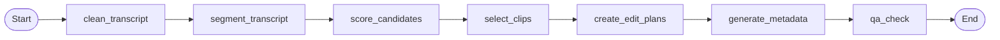

# Agent Workflow

The agent pipeline is the AI decision-making core of ClipForge. It takes a transcript and produces structured `EditPlan` objects that tell FFmpeg exactly how to render each clip. The pipeline is built on **LangGraph** and consists of 7 nodes that process a shared `PipelineState`.

## Pipeline Graph



The pipeline is linear in the MVP. Each node is a pure function that reads from and writes to the shared state. The graph is defined in `backend/app/agents/graph.py` using LangGraph's `StateGraph`.

## PipelineState

The `PipelineState` is a `TypedDict` defined in `backend/app/agents/state.py`. It flows through all 7 nodes, accumulating results.

| Field | Type | Set By | Description |
|-------|------|--------|-------------|
| **Inputs** | | | |
| `video_id` | `str` | Caller | Source video job ID |
| `transcript_raw` | `str` | Caller | Raw transcript text from Whisper |
| `target_clip_count` | `int` | Caller | How many clips to produce |
| `clip_duration_min` | `float` | Caller | Minimum clip duration (seconds) |
| `clip_duration_max` | `float` | Caller | Maximum clip duration (seconds) |
| `target_audience` | `str` | Caller | Target audience description |
| `tone` | `str` | Caller | Content tone (professional, educational, etc.) |
| **Intermediates** | | | |
| `transcript_clean` | `str` | Node 1 | Cleaned transcript (MVP: same as raw) |
| `segments` | `list[TranscriptSegment]` | Node 2 | Candidate moment segments |
| `candidates` | `list[TranscriptSegment]` | Node 2 | Same as segments (aliased for clarity) |
| `candidate_scores` | `list[ClipScore]` | Node 3 | 6-dimension scores per candidate |
| **Outputs** | | | |
| `edit_plans` | `list[EditPlan]` | Node 5 | Complete rendering instructions |
| `metadata_list` | `list[PublishMetadata]` | Node 6 | Titles, descriptions, hashtags |
| `qa_results` | `list[QAResult]` | Node 7 | Pass/fail per clip with issues |
| **Control** | | | |
| `errors` | `list[str]` | Any node | Error messages from failed nodes |
| `current_stage` | `str` | Any node | Current processing stage name |

## Node Details

### Node 1: `clean_transcript`

**Module:** `backend/app/agents/nodes.py`

**Purpose:** Clean and normalize the raw transcript — remove filler words, fix transcription errors, improve readability.

**MVP behavior:** Pass-through. Returns the raw transcript unchanged.

**LLM upgrade:** Use the `TRANSCRIPT_CLEANING_PROMPT` template from `prompts.py` to have an LLM clean the transcript. Parse output with `CleanedTranscriptResponse` schema.

| | |
|---|---|
| **Input** | `state["transcript_raw"]` |
| **Output** | `{"transcript_clean": str}` |
| **Error** | If transcript is missing → appends error, pipeline continues |

---

### Node 2: `segment_transcript_node`

**Module:** `backend/app/agents/nodes.py` → calls `segment_transcript()` from `video_pipeline/segment.py`

**Purpose:** Group consecutive transcript segments into candidate moments of 30–90 seconds. These candidates are the pool from which clips will be selected.

**How it works:** Iterates through transcript segments, merging consecutive segments until the merged duration falls within `[clip_duration_min, clip_duration_max]`. Splits at natural boundaries (segment breaks).

| | |
|---|---|
| **Input** | `state["transcript_clean"]`, `state["clip_duration_min"]`, `state["clip_duration_max"]` |
| **Output** | `{"segments": list[TranscriptSegment], "candidates": list[TranscriptSegment]}` |
| **Error** | If transcript is missing → appends error |

---

### Node 3: `score_candidates_node`

**Module:** `backend/app/agents/nodes.py` → calls `score_segment_heuristic()` from `video_pipeline/clip_selection.py`

**Purpose:** Score each candidate segment on 6 dimensions to identify the most engaging moments.

**Scoring dimensions (0–1 each):**

| Dimension | Heuristic Signal | Weight |
|-----------|-----------------|--------|
| `hook_strength` | Questions in opening, strong opening words | High |
| `standalone_clarity` | Word density, complete sentences | Medium |
| `insight_value` | Numbers, statistics, data points | Medium |
| `virality_potential` | Emotional language, superlatives | Medium |
| `audience_fit` | Content relevance (basic keyword matching) | Low |
| `overall` | Weighted average of above dimensions | — |

**LLM upgrade:** Use the `CLIP_SELECTION_PROMPT` template with `ClipScoreOutput` schema for LLM-powered scoring that considers context, narrative arc, and audience engagement.

| | |
|---|---|
| **Input** | `state["candidates"]` |
| **Output** | `{"candidate_scores": list[ClipScore]}` |
| **Error** | If no candidates → appends error |

---

### Node 4: `select_clips_node`

**Module:** `backend/app/agents/nodes.py` → calls `select_top_clips()` from `video_pipeline/clip_selection.py`

**Purpose:** Select the top N candidates by overall score, where N is `target_clip_count`.

**How it works:** Sorts candidates by `ClipScore.overall` descending, takes the first `target_clip_count` entries. Returns paired `(segment, score)` tuples.

| | |
|---|---|
| **Input** | `state["candidates"]`, `state["candidate_scores"]`, `state["target_clip_count"]` |
| **Output** | `{"candidates": list[TranscriptSegment]}` (filtered to top N) |
| **Error** | If no candidates → appends error |

---

### Node 5: `create_edit_plans_node`

**Module:** `backend/app/agents/nodes.py` → calls `build_edit_plan()` from `video_pipeline/edit_plan.py`

**Purpose:** Convert each selected segment into a complete `EditPlan` — the structured instruction set that tells FFmpeg exactly what to do.

**What gets set:**
- `start_time`, `end_time` from segment timestamps
- `hook` extracted from the first sentence
- `caption_style` with default font (Inter), colors, position
- `audio` settings (normalize: true by default)
- `format` set to `vertical_9_16`
- `score` from the scoring node
- `selection_reason` from heuristic analysis

**LLM upgrade:** Use the `EDIT_PLAN_PROMPT` template with `SelectedClipOutput` schema for richer hook extraction and visual edit suggestions.

| | |
|---|---|
| **Input** | `state["candidates"]`, `state["candidate_scores"]`, `state["video_id"]` |
| **Output** | `{"edit_plans": list[EditPlan]}` |
| **Error** | If no candidates → appends error |

---

### Node 6: `generate_metadata_node`

**Module:** `backend/app/agents/nodes.py` → calls `generate_metadata_heuristic()` from `video_pipeline/metadata.py`

**Purpose:** Generate publishing metadata (title, description, hashtags) for each clip.

**Heuristic approach:**
- **Title:** First sentence of the clip transcript, truncated to 100 characters
- **Description:** First two sentences
- **Hashtags:** Capitalized words extracted from the transcript text

**LLM upgrade:** Use the `METADATA_PROMPT` template with `MetadataResponse` schema for platform-optimized titles, SEO descriptions, and trending hashtags.

| | |
|---|---|
| **Input** | `state["edit_plans"]` |
| **Output** | `{"edit_plans": list[EditPlan]}` (plans updated with metadata) |
| **Error** | If no edit plans → appends error |

---

### Node 7: `qa_check_node`

**Module:** `backend/app/agents/nodes.py` → calls `run_qa_checks()` from `video_pipeline/qa.py`

**Purpose:** Validate each edit plan against quality rules before rendering.

**Checks:**
- Timestamps valid (`start < end`)
- Duration within allowed range (5–180 seconds)
- Hook text is not empty
- Title is not empty
- Description is not empty
- At least one hashtag

| | |
|---|---|
| **Input** | `state["edit_plans"]` |
| **Output** | `{"qa_results": list[QAResult]}` |
| **Error** | Never fails — reports issues in QA results |

---

## Heuristic vs LLM Scoring

The MVP pipeline uses **heuristic scoring** — deterministic rules based on text analysis (word density, question marks, numbers, segment length). This requires no API key and runs instantly.

When `OPENAI_API_KEY` is configured, nodes can be upgraded to **LLM-powered scoring** using the prompt templates in `backend/app/agents/prompts.py` and the Pydantic output schemas in `backend/app/agents/schemas.py`.

| Capability | Heuristic (MVP) | LLM (with API key) |
|------------|-----------------|---------------------|
| Transcript cleaning | Pass-through | Filler removal, grammar fixes |
| Moment selection | Word density + structure signals | Context-aware engagement analysis |
| Scoring | Rule-based (0–1 floats) | Multi-dimensional LLM scoring |
| Hook extraction | First sentence | LLM-crafted hooks |
| Metadata | First sentence → title | Platform-optimized titles + SEO |
| Speed | Instant | 5–30s per node (API latency) |
| Cost | Free | OpenAI API usage fees |

## Upgrading a Node to LLM

To upgrade any node from heuristic to LLM-powered:

1. **Import the prompt template** from `backend/app/agents/prompts.py`:
   ```python
   from app.agents.prompts import CLIP_SELECTION_PROMPT
   ```

2. **Import the output schema** from `backend/app/agents/schemas.py`:
   ```python
   from app.agents.schemas import ClipSelectionResponse
   ```

3. **Replace the heuristic logic** with an LLM call:
   ```python
   from langchain_openai import ChatOpenAI

   llm = ChatOpenAI(model="gpt-4o")
   structured_llm = llm.with_structured_output(ClipSelectionResponse)
   result = structured_llm.invoke(CLIP_SELECTION_PROMPT.format(...))
   ```

4. **Parse the response** — the Pydantic schema validates the LLM output automatically.

Available prompt templates:
| Template | Schema | Purpose |
|----------|--------|---------|
| `TRANSCRIPT_CLEANING_PROMPT` | `CleanedTranscriptResponse` | Clean filler words, fix errors |
| `SEGMENTATION_PROMPT` | `SegmentationResponse` | Identify clip-worthy moments |
| `CLIP_SELECTION_PROMPT` | `ClipSelectionResponse` | Score and rank candidates |
| `EDIT_PLAN_PROMPT` | `SelectedClipOutput` | Generate detailed edit instructions |
| `METADATA_PROMPT` | `MetadataResponse` | Generate titles, descriptions, hashtags |

## Error Handling

Each node wraps its logic in a try/except block. On failure:
1. The error message is appended to `state["errors"]`
2. The pipeline **continues** to the next node
3. Downstream nodes handle missing data gracefully (e.g., empty candidate list → empty edit plans)

This means a partial failure (e.g., metadata generation fails) still produces clips — just without metadata. The QA node reports all issues, giving the user visibility into what went wrong.

## Calling the Pipeline

```python
from app.agents.graph import run_pipeline

result = run_pipeline(
    video_id="abc123",
    transcript=transcript_object,
    target_clip_count=5,
    clip_duration_min=30.0,
    clip_duration_max=60.0,
    target_audience="SaaS founders",
    tone="professional",
)

# Access results
edit_plans = result["edit_plans"]      # list[EditPlan]
qa_results = result["qa_results"]      # list[QAResult]
errors = result["errors"]              # list[str] — empty if no errors
```

The Celery task `process_video_job` calls `run_pipeline()` and then passes each `EditPlan` to `render_clip_from_edit_plan()`.
