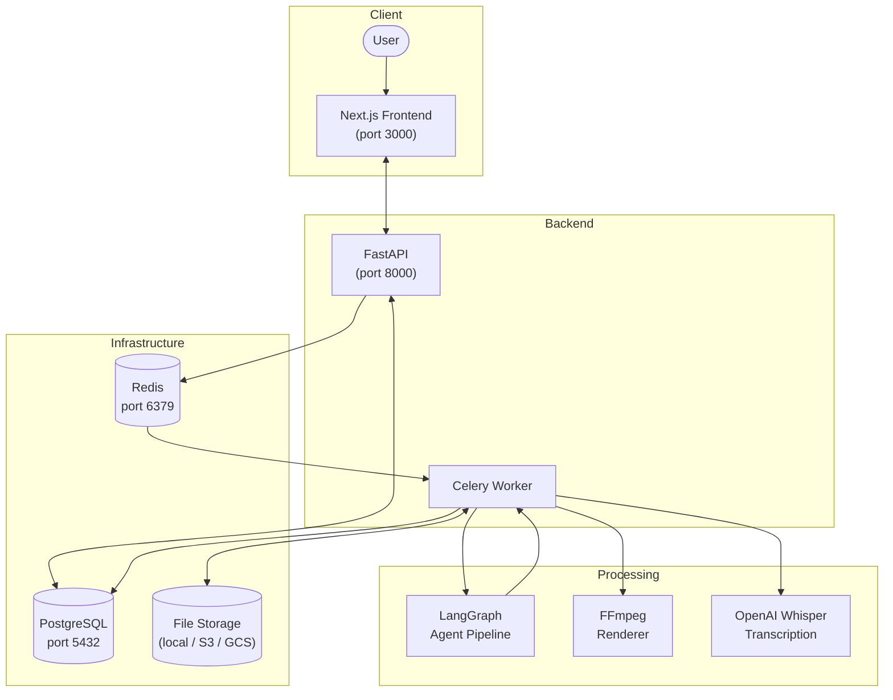
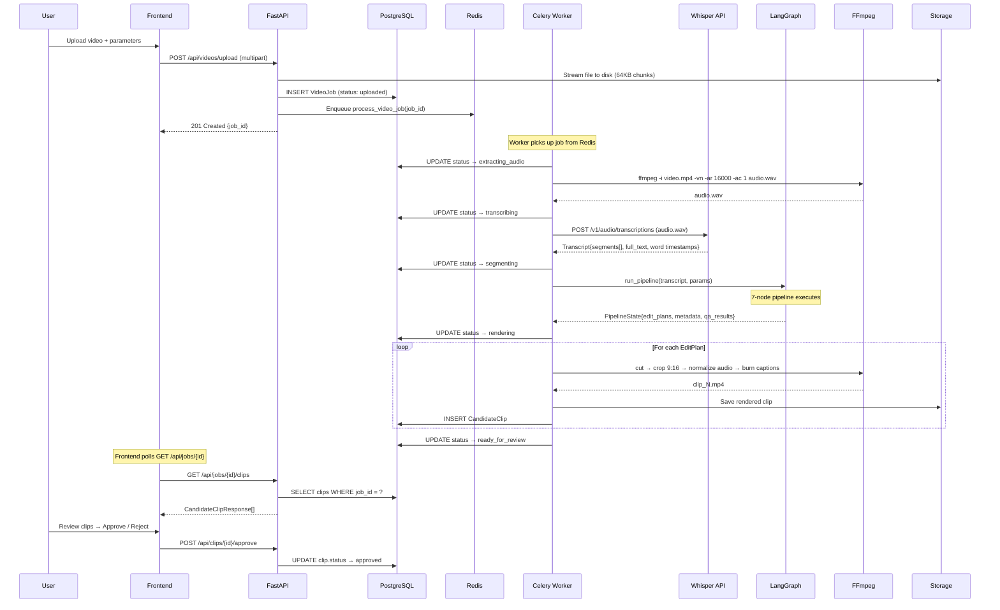
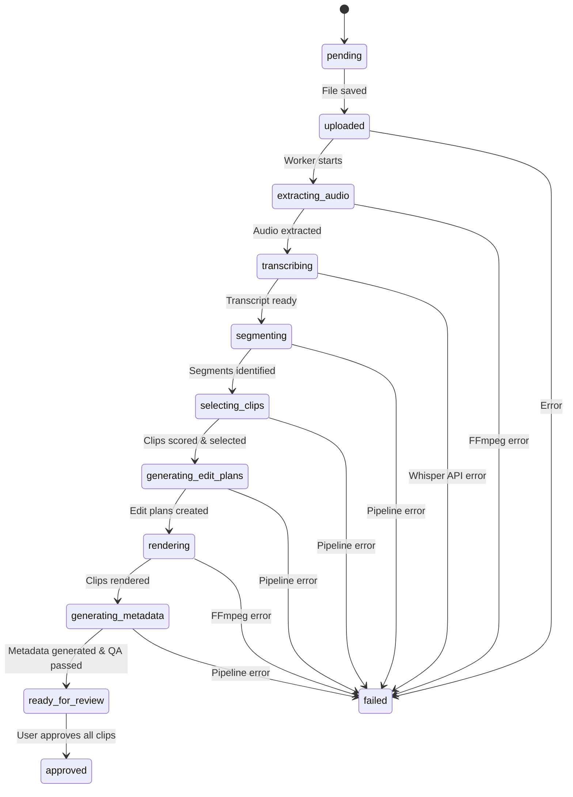

# Architecture

This document describes the system architecture of ClipForge AI — how the components fit together, why each exists, and how data flows from a raw video upload to a set of approved short-form clips.

## System Overview



## Architectural Principles

### 1. AI Decides, Tools Execute

The core design constraint: AI agents produce **structured data** (edit plans, scores, metadata). Deterministic tools (FFmpeg, SRT generators) execute those decisions. The AI never directly manipulates video frames, audio samples, or files.

Why this matters:
- **Debuggability** — When a clip looks wrong, inspect the `EditPlan` JSON to see exactly what the AI decided. Fix the plan, re-render. No need to rerun the entire AI pipeline.
- **Reproducibility** — Given the same `EditPlan`, FFmpeg produces the same output every time.
- **Safety** — The AI cannot accidentally corrupt media, delete files, or produce unbounded output.

### 2. Background Processing

Video processing is **never done in the API request cycle**. The upload endpoint saves the file, creates a database record, and enqueues a Celery task. The frontend polls for status updates. This means:
- The API stays responsive (sub-second responses)
- Long-running FFmpeg operations don't block other users
- Failed jobs can be retried without re-uploading

### 3. Typed Contracts Everywhere

Every boundary between components has a Pydantic schema:
- **API ↔ Frontend**: `VideoJobResponse`, `CandidateClipResponse`, `BrandProfile`
- **AI ↔ Rendering**: `EditPlan` — the central contract containing timestamps, hook, caption style, audio settings, visual edits, and metadata
- **Pipeline State**: `PipelineState` TypedDict flows through all 7 LangGraph nodes

### 4. Storage Abstraction

File storage is behind a `StorageBackend` abstract base class (`backend/app/storage/base.py`). The MVP uses `LocalStorage` (filesystem). Switching to S3 or GCS requires changing one environment variable (`STORAGE_BACKEND`) and implementing the interface.

## End-to-End Data Flow



## Job Lifecycle

A `VideoJob` progresses through these states:



The Celery task updates the job status at each stage so the frontend can show real-time progress. On failure, the error message is saved to `VideoJob.error_message` and the status moves to `failed`. The task supports automatic retries (up to 2) for transient errors like network timeouts (`IOError`, `ConnectionError`), with exponential backoff.

## Component Deep-Dives

### Next.js Frontend

| | |
|---|---|
| **Framework** | Next.js 16 (App Router, Turbopack) |
| **UI Library** | shadcn/ui v4 (built on @base-ui/react) |
| **Styling** | Tailwind CSS v4 (oklch color space) |
| **API Client** | Typed fetch wrapper with 15s timeout (`lib/api.ts`) |
| **State** | React hooks (`useState`, `useEffect`) with 5s polling |

**Pages:**
- `/` — Dashboard with metrics and recent jobs table
- `/upload` — Video upload with drag-and-drop and parameter form
- `/jobs/[jobId]` — Job detail with processing status
- `/jobs/[jobId]/review` — Clip review with approve/reject actions
- `/settings/brand` — Brand profile settings (colors, fonts, captions)

The frontend shows a "Backend unavailable" banner when the API is unreachable, and falls back to mock data for UI development without a running backend.

### FastAPI Backend

| | |
|---|---|
| **Framework** | FastAPI 0.115+ with Pydantic v2 |
| **Database** | SQLAlchemy 2.0 async (asyncpg for PostgreSQL, aiosqlite for dev) |
| **Logging** | structlog with JSON output (production) or colored console (dev) |
| **Error handling** | `ClipForgeError` hierarchy with custom exception handlers |

**Route modules:**
- `routes_upload.py` — `POST /api/videos/upload` (streaming upload, 64KB chunks, mid-stream size validation)
- `routes_jobs.py` — `GET /api/jobs`, `GET /api/jobs/{id}`, `GET /api/jobs/{id}/clips`
- `routes_clips.py` — Approve, reject, regenerate metadata, re-render, download
- `routes_brand.py` — `GET` and `PUT /api/brand-profile`

Upload security: files are streamed to disk in chunks (never fully loaded into memory), file size is validated mid-stream, and the download endpoint validates that file paths stay within the storage root (path traversal protection).

### Celery Workers

| | |
|---|---|
| **Broker** | Redis |
| **Serializer** | JSON |
| **Time limits** | 30 min soft / 60 min hard |
| **Retries** | 2 max, with exponential backoff (30s base) for `IOError` and `ConnectionError` |

The main task is `process_video_job(job_id)`. It runs the full pipeline sequentially: extract audio → transcribe → run agent pipeline → render clips → save results. The task uses a shared `@lru_cache` synchronous SQLAlchemy engine to avoid creating a new database connection on every status update.

### LangGraph Agent Pipeline

A linear 7-node `StateGraph` built on LangGraph. Each node is a pure function that reads from and writes to a shared `PipelineState` TypedDict.

```
clean_transcript → segment → score_candidates → select_clips → edit_plans → metadata → qa_check
```

See [docs/agents.md](agents.md) for detailed node documentation.

MVP uses heuristic scoring (no LLM calls required). Each node has a pre-built LLM prompt template in `agents/prompts.py` and a Pydantic output schema in `agents/schemas.py` for easy upgrade to LLM-powered processing.

### FFmpeg Rendering Pipeline

For each `EditPlan`, the rendering pipeline runs these FFmpeg operations in sequence:

1. **Cut** — Extract the time range (`-ss`, `-t` flags)
2. **Crop to 9:16** — Center crop and scale to 1080×1920 (`crop=ih*9/16:ih,scale=1080:1920`)
3. **Normalize audio** — Apply loudness normalization (`loudnorm` filter, target -16 LUFS)
4. **Burn captions** — Overlay SRT subtitles using libass (`subtitles` filter)

See [docs/video-pipeline.md](video-pipeline.md) for the full pipeline reference.

### Storage Abstraction

```
StorageBackend (ABC)
├── save(key, data) → str
├── save_file(key, source_path) → str
├── get(key) → bytes
├── get_path(key) → Path
├── delete(key) → None
├── exists(key) → bool
└── get_url(key) → str

LocalStorage(StorageBackend)
└── Stores files under LOCAL_STORAGE_PATH
    with path traversal protection
```

## Database Schema

### VideoJob

| Column | Type | Description |
|--------|------|-------------|
| `id` | `String (PK)` | UUID hex |
| `original_filename` | `String` | Original upload filename |
| `file_size_bytes` | `Integer` | File size |
| `storage_path` | `String` | Path in storage backend |
| `status` | `Enum` | One of 11 job statuses (see lifecycle diagram) |
| `current_stage_message` | `String` | Human-readable progress message |
| `error_message` | `Text (nullable)` | Error details if failed |
| `retry_count` | `Integer` | Number of retry attempts |
| `params` | `JSON` | Serialized `VideoUploadParams` |
| `transcript_path` | `String (nullable)` | Path to transcript JSON |
| `edit_plans_path` | `String (nullable)` | Path to edit plans JSON |
| `created_at` | `DateTime` | UTC creation timestamp |
| `updated_at` | `DateTime` | UTC last-modified timestamp |

### CandidateClip

| Column | Type | Description |
|--------|------|-------------|
| `id` | `String (PK)` | UUID hex |
| `job_id` | `String (FK)` | References `VideoJob.id` |
| `clip_index` | `Integer` | Sequential index (0-based) |
| `status` | `Enum` | `pending`, `approved`, `rejected` |
| `edit_plan` | `JSON` | Serialized `EditPlan` |
| `transcript_snippet` | `String` | Excerpt of clip transcript |
| `rendered_path` | `String (nullable)` | Path to rendered `.mp4` |
| `start_time` | `Float` | Clip start in source video (seconds) |
| `end_time` | `Float` | Clip end in source video (seconds) |
| `score_overall` | `Float` | Overall quality score (0–1) |
| `created_at` | `DateTime` | UTC creation timestamp |
| `updated_at` | `DateTime` | UTC last-modified timestamp |

### BrandProfileModel

| Column | Type | Description |
|--------|------|-------------|
| `id` | `String (PK)` | Default: `"default"` |
| `data` | `JSON` | Serialized `BrandProfile` |
| `created_at` | `DateTime` | UTC creation timestamp |
| `updated_at` | `DateTime` | UTC last-modified timestamp |

## The EditPlan Contract

The `EditPlan` is the central data structure that bridges AI decision-making and deterministic rendering. It is a Pydantic model defined in `backend/app/schemas/clip.py`.

```
EditPlan
├── clip_id: str                    # Unique clip identifier
├── source_video_id: str            # Reference to source VideoJob
├── start_time: float               # Start time in source (seconds)
├── end_time: float                 # End time in source (seconds)
├── format: VideoFormat             # vertical_9_16, horizontal_16_9, square_1_1
├── target_platform: TargetPlatform # youtube_shorts, tiktok, instagram_reels, linkedin
├── hook: str                       # Opening hook text
├── selection_reason: str           # Why this moment was selected
├── score: ClipScore                # 6-dimension scoring (0–1 each)
├── caption_style: CaptionStyle     # Font, colors, position
├── visual_edits: list[VisualEdit]  # Zoom, CTA bars, overlays
├── audio: AudioSettings            # Normalize, noise reduction
└── metadata: PublishMetadata       # Title, description, hashtags
```

The AI agent pipeline produces `EditPlan` objects. The FFmpeg rendering pipeline consumes them. This contract means you can:
- Inspect what the AI decided by reading the JSON
- Manually edit a plan and re-render
- Swap the AI pipeline without changing the renderer
- Swap the renderer without changing the AI pipeline
