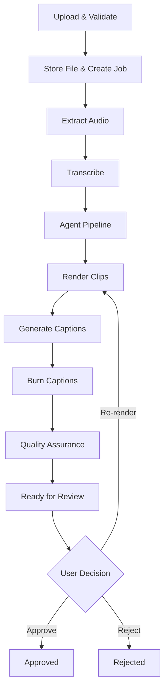

# Video Processing Pipeline

This document describes every stage of the video processing pipeline, from the moment a file is uploaded to the final rendered clip ready for review. Each stage lists what happens, why it matters, which module is responsible, the input and output, what can go wrong, and how to debug it.

## Pipeline Overview



---

## Stage 1: Upload & Validate

**What happens:** The user submits a video file via the upload form or API. The backend validates the file before saving it.

**Why it matters:** Rejecting invalid files early prevents wasted processing time and storage. Streaming validation avoids loading large files into memory.

**Module:** `backend/app/video_pipeline/ingest.py`, `backend/app/api/routes_upload.py`

**Input:**
- Multipart form data: video file + processing parameters (clip count, duration range, platform, tone, target audience)

**Output:**
- File saved to `storage/jobs/{job_id}/original.{ext}`
- `VideoJob` record created in database (status: `uploaded`)
- Celery task `process_video_job` enqueued

**Validation checks:**
| Check | Rule | Error |
|-------|------|-------|
| Extension | Must be `.mp4`, `.mov`, `.avi`, `.mkv`, or `.webm` | `InvalidVideoError` |
| MIME type | Must match `video/*` variants | `InvalidVideoError` |
| File size | Must be > 0 bytes and ≤ `MAX_UPLOAD_SIZE_MB` | `InvalidVideoError` |
| Filename | Must not be empty | `InvalidVideoError` |

**What can go wrong:**
- File exceeds size limit → 422 error returned, partial file cleaned up
- Unsupported format → 422 error before any data is saved
- Disk full → 500 error during streaming write

**How to debug:**
- Check API logs for `InvalidVideoError` details
- Verify `MAX_UPLOAD_SIZE_MB` in `.env` (default: 500)
- Check disk space on the storage volume

---

## Stage 2: Extract Audio

**What happens:** FFmpeg extracts the audio track from the video as a 16kHz mono WAV file, optimized for speech recognition.

**Why it matters:** Whisper expects audio input, not video. Downsampling to 16kHz mono reduces file size and processing time without affecting transcription quality (speech is well below 8kHz).

**Module:** `backend/app/video_pipeline/audio.py` → `extract_audio()`

**Input:** `storage/jobs/{job_id}/original.mp4`

**Output:** `storage/jobs/{job_id}/audio.wav`

**FFmpeg command:**
```bash
ffmpeg -i input.mp4 -vn -acodec pcm_s16le -ar 16000 -ac 1 audio.wav
```

| Flag | Purpose |
|------|---------|
| `-vn` | Discard video stream |
| `-acodec pcm_s16le` | Uncompressed 16-bit PCM |
| `-ar 16000` | 16kHz sample rate (Whisper optimized) |
| `-ac 1` | Mono channel |

**What can go wrong:**
- FFmpeg not installed → `FFmpegError` with "command not found"
- Corrupt video file → FFmpeg returns non-zero exit code
- No audio track in video → FFmpeg produces empty output

**How to debug:**
- Run `ffmpeg -version` to verify installation
- Run the FFmpeg command manually on the source file
- Check `audio.py` logs for stderr output from FFmpeg

---

## Stage 3: Transcribe

**What happens:** The extracted audio is sent to the OpenAI Whisper API, which returns a structured transcript with word-level timestamps.

**Why it matters:** Word-level timestamps are essential for precise caption synchronization. The structured transcript (`Transcript` schema) feeds the entire agent pipeline.

**Module:** `backend/app/video_pipeline/transcribe.py` → `OpenAIWhisperService.transcribe()`

**Input:** `storage/jobs/{job_id}/audio.wav`

**Output:** `Transcript` object with:
- `segments[]` — Each segment has `start_time`, `end_time`, `text`, `words[]`
- `full_text` — Concatenated transcript
- `duration_seconds` — Total audio duration

Saved to: `storage/jobs/{job_id}/transcript.json`

**What can go wrong:**
- Missing `OPENAI_API_KEY` → Falls back to `MockTranscriptionService` (returns fixture data)
- API rate limit or network error → `ConnectionError` (Celery retries up to 2 times)
- Audio too long → Whisper has a 25MB file size limit; long videos may need chunking

**How to debug:**
- Verify `OPENAI_API_KEY` is set in `.env`
- Check Celery worker logs for API error responses
- Test with a short audio file first
- Use `MockTranscriptionService` for development (set `OPENAI_API_KEY=""`)

---

## Stage 4: Agent Pipeline (Segment → Score → Select → Plan → Metadata → QA)

**What happens:** The transcript flows through a 7-node LangGraph pipeline that identifies the best moments, scores them, generates edit plans, produces metadata, and runs quality checks.

**Why it matters:** This is where the AI "decides" what clips to create. The output is a set of `EditPlan` objects — structured instructions that the renderer can execute deterministically.

**Module:** `backend/app/agents/graph.py` → `run_pipeline()`

**Input:** `Transcript`, processing parameters (clip count, duration range, audience, tone)

**Output:** `PipelineState` containing:
- `edit_plans: list[EditPlan]` — One per selected clip
- `metadata_list` — Titles, descriptions, hashtags
- `qa_results` — Pass/fail for each plan

Saved to: `storage/jobs/{job_id}/edit_plans.json`

See [docs/agents.md](agents.md) for detailed documentation of each node.

**Pipeline nodes:**

| # | Node | Input | Output |
|---|------|-------|--------|
| 1 | `clean_transcript` | Raw transcript | Cleaned transcript (MVP: pass-through) |
| 2 | `segment_transcript_node` | Cleaned transcript | Candidate segments (30–90s chunks) |
| 3 | `score_candidates_node` | Candidate segments | `ClipScore` per candidate (6 dimensions, 0–1) |
| 4 | `select_clips_node` | Scored candidates | Top N candidates by overall score |
| 5 | `create_edit_plans_node` | Selected segments + scores | `EditPlan` per clip (timestamps, hook, style, audio) |
| 6 | `generate_metadata_node` | Edit plans | Updated plans with title, description, hashtags |
| 7 | `qa_check_node` | Complete plans | QA results (pass/fail with issue list) |

**What can go wrong:**
- No candidates found (video too short or transcript too sparse) → Empty edit plans list
- Node error → Appended to `state["errors"]`, pipeline continues with partial results
- QA fails (clip too short, missing metadata) → `QAResult.passed = false` with issue list

**How to debug:**
- Inspect `edit_plans.json` in the job storage directory
- Check `state["errors"]` in Celery logs
- Look for QA failures in the `qa_results` field
- Set `LOG_LEVEL=DEBUG` for verbose agent output

---

## Stage 5: Render Clips

**What happens:** For each `EditPlan`, FFmpeg executes a multi-step rendering pipeline: cut the time range, crop to vertical, normalize audio, and burn captions.

**Why it matters:** This is where AI decisions become actual video files. The renderer is a pure function of the `EditPlan` — same plan always produces the same output.

**Module:** `backend/app/video_pipeline/render.py` → `render_clip_from_edit_plan()`

**Input:**
- Source video: `storage/jobs/{job_id}/original.mp4`
- `EditPlan` with timestamps, format, audio settings, caption style

**Output:** `storage/jobs/{job_id}/clips/clip_{N}.mp4`

**Rendering steps:**

### Step 5a: Cut Clip
```bash
ffmpeg -i source.mp4 -ss 10.5 -t 45.0 -c:v libx264 -c:a aac cut.mp4
```
Extracts the time range specified by `EditPlan.start_time` and `EditPlan.end_time`.

### Step 5b: Crop to Vertical (9:16)
```bash
ffmpeg -i cut.mp4 -vf "crop=ih*9/16:ih,scale=1080:1920" cropped.mp4
```
Center-crops the frame to 9:16 aspect ratio and scales to 1080×1920 pixels.

### Step 5c: Normalize Audio (if enabled)
```bash
ffmpeg -i cropped.mp4 -af "loudnorm=I=-16:TP=-1.5:LRA=11" normalized.mp4
```
Applies EBU R128 loudness normalization. Target: -16 LUFS integrated, -1.5 dBTP true peak.

### Step 5d: Generate SRT Captions
The transcript segments within the clip's time range are converted to SRT format with time offsets adjusted relative to the clip start.

**Module:** `backend/app/video_pipeline/captions.py` → `generate_srt()`

**Output:** `storage/jobs/{job_id}/clips/clip_{N}.srt`

### Step 5e: Burn Captions
```bash
ffmpeg -i normalized.mp4 -vf "subtitles=clip_0.srt:force_style='FontName=Inter,FontSize=24,PrimaryColour=&HFFFFFF&'" final.mp4
```
Burns SRT subtitles into the video using libass.

**Module:** `backend/app/video_pipeline/captions.py` → `burn_captions()`

**What can go wrong:**
- FFmpeg error during any step → `FFmpegError` with stderr details
- Source video missing → `FileNotFoundError`
- Invalid time range (start ≥ end) → `ValueError` before FFmpeg runs
- Disk space exhaustion → Partial files left behind

**How to debug:**
- Check Celery logs for FFmpeg stderr output
- Run FFmpeg commands manually on the source file
- Inspect intermediate files in the job directory (`cut.mp4`, `cropped.mp4`, etc.)
- Verify FFmpeg has libass support: `ffmpeg -filters | grep subtitles`

---

## Stage 6: Quality Assurance

**What happens:** Each rendered clip and its edit plan are validated against quality rules.

**Why it matters:** Catches problems before clips reach the review interface — bad timestamps, missing metadata, missing rendered files.

**Module:** `backend/app/video_pipeline/qa.py` → `run_qa_checks()`

**Input:** `EditPlan` + rendered file path + optional SRT path

**Output:** `QAResult` with `passed: bool` and `issues: list[str]`

**Checks performed:**
| Check | Rule | Failure |
|-------|------|---------|
| Timestamps | `start_time < end_time` | "Start time must be before end time" |
| Duration | 5–180 seconds | "Clip duration out of range" |
| Rendered file | File exists at `rendered_path` | "Rendered file not found" |
| Title | Non-empty string | "Missing title" |
| Description | Non-empty string | "Missing description" |
| Hashtags | At least one hashtag | "No hashtags" |

---

## Stage 7: Review & Approve

**What happens:** The frontend displays all generated clips with their scores, hooks, transcript snippets, and metadata. The user approves, rejects, or requests changes.

**Module:** Frontend `app/jobs/[jobId]/review/page.tsx`, Backend `backend/app/api/routes_clips.py`

**Available actions:**
| Action | Endpoint | Effect |
|--------|----------|--------|
| Approve | `POST /api/clips/{id}/approve` | Sets clip status to `approved` |
| Reject | `POST /api/clips/{id}/reject` | Sets clip status to `rejected` |
| Regenerate metadata | `POST /api/clips/{id}/regenerate-metadata` | Re-runs metadata generation |
| Re-render | `POST /api/clips/{id}/render` | Re-runs FFmpeg rendering |
| Download | `GET /api/clips/{id}/download` | Returns rendered `.mp4` file |

---

## Output File Reference

After processing completes, the job storage directory contains:

```
storage/jobs/{job_id}/
├── original.mp4              # Source video (as uploaded)
├── audio.wav                 # Extracted audio (16kHz mono PCM)
├── transcript.json           # Whisper transcript (segments + word timestamps)
├── edit_plans.json           # Agent-generated edit plans (JSON array)
├── clips/
│   ├── clip_0_cut.mp4        # Intermediate: time-range cut
│   ├── clip_0_cropped.mp4    # Intermediate: cropped to 9:16
│   ├── clip_0.srt            # Caption file
│   ├── clip_0.mp4            # Final rendered clip
│   ├── clip_1.srt
│   ├── clip_1.mp4
│   └── ...
```

## FFmpeg Commands Reference

| Operation | Command | Module |
|-----------|---------|--------|
| Extract audio | `ffmpeg -i in.mp4 -vn -acodec pcm_s16le -ar 16000 -ac 1 out.wav` | `audio.py` |
| Normalize audio | `ffmpeg -i in.wav -af "loudnorm=I=-16:TP=-1.5:LRA=11" out.wav` | `audio.py` |
| Cut clip | `ffmpeg -i in.mp4 -ss {start} -t {duration} -c:v libx264 -c:a aac out.mp4` | `render.py` |
| Crop to 9:16 | `ffmpeg -i in.mp4 -vf "crop=ih*9/16:ih,scale=1080:1920" out.mp4` | `render.py` |
| Burn captions | `ffmpeg -i in.mp4 -vf "subtitles=in.srt:force_style='...'" out.mp4` | `captions.py` |
